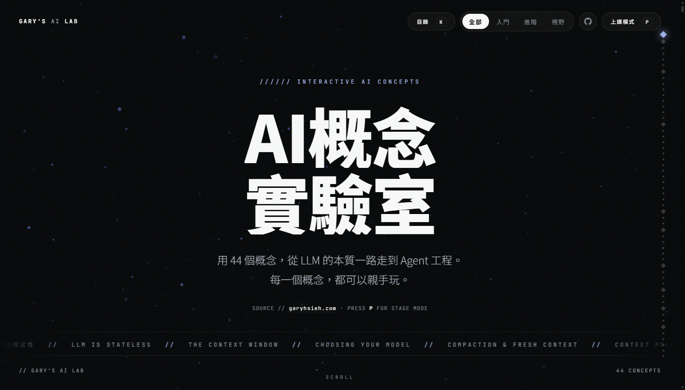
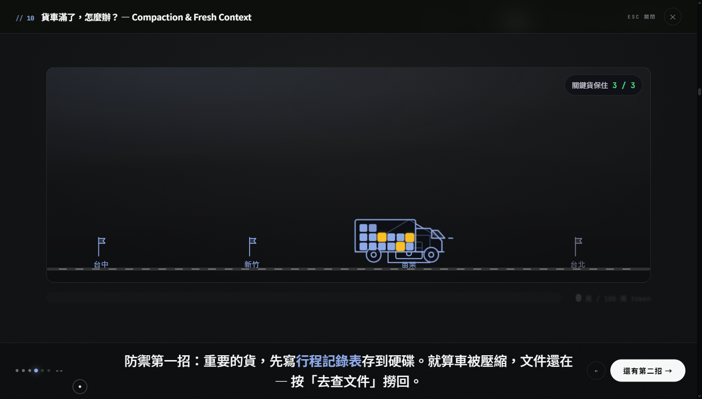
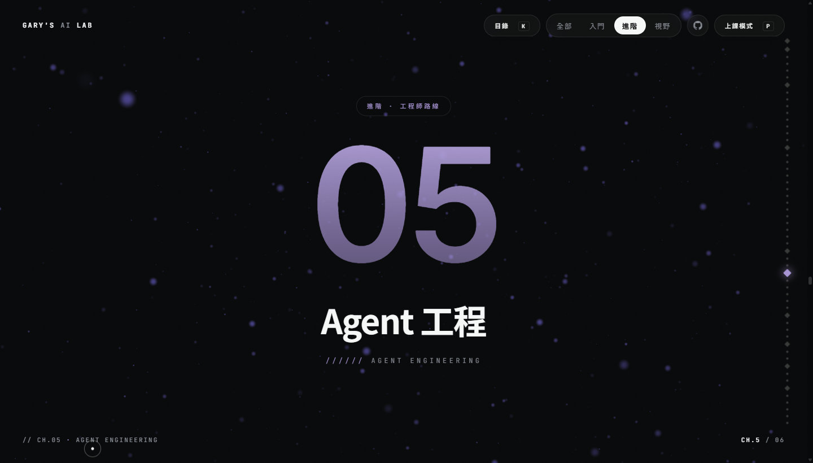

<sub>An interactive lab for AI/LLM/agent concepts — every concept ships with a hand-built, directed demo you can play with. Content in Traditional Chinese.</sub>

# AI 概念實驗室 · LLM Agent Playground

[](https://www.garyhsieh.com/ai-lab)&nbsp;[](#課綱總覽)&nbsp;[](LICENSE)&nbsp;[](LICENSE-CONTENT.md)&nbsp;[](site/package.json)

把 [garyhsieh.com](https://www.garyhsieh.com) 的 AI 心得文章，做成一座**可以親手玩的教學實驗室** —— 九章、44 個概念，從 LLM 的本質一路走到 Agent 工程，每一個概念都有自己的互動 demo。

### ▶︎ [開啟網站 — garyhsieh.com/ai-lab](https://www.garyhsieh.com/ai-lab)



---

## 這是什麼，特別在哪

這不是「文章整理」，是一套**為了站在台前講課而做的教材**。

- **每個概念都是一個可玩的 demo，不是一張圖。** 每一個概念都對應一支手寫的 vanilla JS 互動模組（`site/src/demos/`），全部本地模擬、不打任何 API。文字接龍、貨車 compaction、context 汙染與時光機、四層權限鑰匙……概念的「對比」是玩出來的，不是讀出來的。
- **導演式分鏡，不是儀表板。** demo 用自製的 `DemoStage` 框架跑：一次只教一件事、同時會動的東西 ≤ 1、主角以外的元素自動變暗模糊、說明走底部字幕式大旁白，最後一拍才把控制權整個交還給你自由實驗。（[往下看](#demo-框架-demostage)）
- **每張概念卡都在自己動。** 概念頁上常駐一支 live teaser micro-animation（`site/src/teasers/`），滾進畫面才掛載、滾出就卸掉，點下去就展開完整 demo。
- **內建上課簡報模式。** 按 `P` 切換，`←`/`→` 換頁、`Enter` 開互動、`Esc` 離開；`K` 叫出概念目錄。同一個站，自己讀跟投影上課兩用。
- **概念檔是唯一內容來源。** 講稿、重點、課堂提問、原文金句全寫在 `concepts/*.md`，網站資料由 build script 產生 —— 改教材只改 Markdown，不碰前端。

---

## 快速開始

```bash
cd site
npm install
npm run dev   # http://localhost:5173
```

`npm run dev` / `npm run build` 前會自動跑 `scripts/build-data.mjs` 重建內容資料。要掛在子路徑下部署（例如 `/ai-lab/`）時設 `AI_LAB_BASE=/ai-lab/ npm run build`。

**網站操作**：滾動瀏覽 → 每張概念卡點「進入互動」；`P` 上課簡報模式、`K` 概念目錄、`←`/`→` 換頁或換分鏡、`Esc` 離開。

---

## 專案結構

```
concepts/              # 教學概念檔（單一內容來源）— NN-<id>.md
docs/                  # 設計研究與落差分析
  interaction-analysis.md    # 拆解 Nicky Case / Seeing Theory / R2D3 等互動教學標竿，提煉出 DemoStage 的六條法則
  teaching-gap-analysis.md   # 授課實錄 vs 網站內容的落差清單（哪些概念要補、怎麼補）
site/
  DEMO_GUIDE.md        # demo 模組合約與 DemoStage 規範（寫 demo 前必讀）
  index.html
  scripts/
    build-data.mjs     # concepts/*.md → src/data/concepts.json
  src/
    main.js            # 章節組版、滾動、簡報模式、概念目錄、demo overlay
    style.css          # 設計系統（Lab HUD）
    bg3d.js            # three.js 星空背景
    data/concepts.json # 自動產生，不要手改
    demos/
      _stage.js        # DemoStage 導演框架（beats / spotlight / juice utils）
      index.js         # demo 註冊表（懶載入）
      <concept-id>.js  # 每個概念一支
    teasers/
      index.js         # teaser 註冊表
      _generic.js      # 沒有自訂 teaser 時的預設動畫
      <concept-id>.js
```

---

## 內容怎麼運作

`concepts/NN-<id>.md` 是**唯一內容來源（single source of truth）**。每個檔案 = frontmatter + 六個固定小節：

```markdown
---
id: browser-use
title: AI 怎麼上網、怎麼操作瀏覽器？
subtitle: Web Search vs. Browser Use
chapter: 3
chapterTitle: 從聊天到 Agent
source:
  - title: "AI Agent 怎麼操作瀏覽器？"
    url: https://www.garyhsieh.com/blog/2026-05-08-ai-agent
    date: 2026-05-08
---

## 一句話        投影片級 punchline
## 三分鐘講稿     保留原文口吻、可直接唸出來
## 關鍵重點       條列
## 互動示範構想    這一節就是該支 demo 的設計稿
## 課堂提問       條列
## 原文金句       引用區塊，逐句對應原文
```

沒有對應文章、整理自課堂實錄的概念，frontmatter 另標 `classroom: true`。

```
concepts/*.md  ──  npm run data  ──▶  site/src/data/concepts.json  ──▶  site/src/main.js
                (build-data.mjs)                                        章節組版 / 講稿 / 出處連結
```

`build-data.mjs` 自己解析 frontmatter 與小節標題（無外部依賴），輸出 `num / id / title / subtitle / chapter / sources / classroom / oneLiner / script / keyPoints / demoIdea / questions / quotes`。**`concepts.json` 是產物，不要手改。**

---

## Demo 框架 DemoStage



一般的教學互動很容易做成「一個滿是控制項的儀表板」—— 使用者看不懂要按哪、也不知道要看哪。`site/src/demos/_stage.js` 是為了避免這件事寫的**導演框架**：把一支 demo 拆成幾拍分鏡（beats），像影片一樣演給你看，最後才放你自己玩。

設計法則（推導過程見 [`docs/interaction-analysis.md`](docs/interaction-analysis.md)）：**一次只教一件事、同時會動的東西 ≤ 1、每次點擊都有 juice、先導遊後放生。**

框架提供：

- **beats 分鏡** —— 一支 demo 3–6 拍，每拍一句旁白、一個焦點；`enter(stage)` / `exit(stage)` 掛動畫與互動。beat 之間**用動畫轉場，不重繪**，狀態轉換要「值得看」。
- **spotlight 視線引導** —— 每拍用 `focus: ['.selector']` 指定主角，其餘標了 `.ds-unit` 的視覺單元自動變暗＋模糊（上圖底部那條 token 計量就是被 dim 掉的）。
- **字幕式旁白** —— 說明文字全部進 beat 的 `narration`，走底部大旁白條（20–28px、`<b>` 自動上主色），畫面上不再有大段引導文。
- **juice 動效工具** —— `pop()` / `shake()` / `enterFly()` / `countUp()` / `confettiBurst()`，讓每次互動都有即時的因果回饋。
- **分鏡導航** —— 底部進度點 + 上一步/下一步，`←`/`→` 由框架接管，demo 內不必自己掛鍵盤。
- **sandbox 收尾** —— 最後一拍標 `sandbox: true`：解除 dim、隱藏「下一步」、開放所有控制自由實驗。

```js
import { createStage, pop, countUp } from './_stage.js'

export default function mount(el, ctx) {
  const stage = createStage(el, ctx, {
    beats: [
      { narration: '大旁白，一次一句，可用 <b>重點</b>。', focus: ['.xx-truck'],
        enter(s) { /* 對 s.body 裡的場景做動畫、掛互動 */ }, exit(s) {} },
      // ... 3-6 拍
      { narration: '換你玩 — 全部解鎖。', sandbox: true, enter(s) { /* 開放所有控制 */ } },
    ],
  })
  stage.body.innerHTML = `...`   // 場景一次蓋好，之後只做動畫
  return stage.destroy           // cleanup 契約
}
```

完整合約（mount 簽名、cleanup 規則、樣式隔離、無網路、效能上限、版面建議）看 **[`site/DEMO_GUIDE.md`](site/DEMO_GUIDE.md)** —— 寫任何一支 demo 之前都該先讀它。

---

## 怎麼新增一個概念

1. **寫概念檔** —— 新增 `concepts/NN-<id>.md`，補齊 frontmatter 與六個小節。**「互動示範構想」那節要當成 demo 的設計稿來寫**：畫面上有什麼、按什麼、看什麼、分鏡怎麼走、哪一拍是「啊哈時刻」。
2. **產資料** —— `cd site && npm run data`，確認 `concepts.json` 裡多了這一筆（`npm run dev` 會自動先跑一次）。
3. **寫 demo** —— 依 [`site/DEMO_GUIDE.md`](site/DEMO_GUIDE.md) 新增 `site/src/demos/<id>.js`，用 `createStage` 把上一步的設計稿實作成 3–6 拍 + 一拍 sandbox。可以為了清楚與可行而簡化，但**核心對比不能丟**。
4. **寫 teaser**（選用）—— 新增 `site/src/teasers/<id>.js`，做一支概念卡上常駐播放的 micro-animation；不寫就自動用 `_generic.js`。
5. **接上兩個註冊表** —— 在 `site/src/demos/index.js` 與 `site/src/teasers/index.js` 各加一行懶載入。**漏接 demo 註冊表 = 概念卡點下去沒反應**，這是最常見的坑。
6. **驗收** —— `npm run dev`：概念卡有動、點進去分鏡走得順、`Esc` 離開後沒有殘留 timer；`P` 進簡報模式再看一次投影效果。

章節本身的中英標題、主色與路徑分類定義在 `site/src/main.js` 頂端的 `CHAPTERS`；要開新章節就在那裡加一筆。

---

## 設計系統



深色編輯風的 **Lab HUD**（`site/src/style.css`）—— 參考 Lando Norris SOTY 2025 的紙白／髮絲線與 Igloo Inc SOTY 2024 的 mono HUD 語彙。

- **深色底 `#08090a` + 紙白 `#f7f8f8`**，髮絲線 `rgba(255,255,255,.09)` 分割，全站蓋一層極淡膠片顆粒。
- **每章一個低飽和主色**（藍 → 青 → 琥珀 → 紫 → 玫瑰 → 橄欖 → 陶土 → 金），滾到該章時 `--accent` 整站漸變切換，連 three.js 星空背景一起換色 —— 顏色就是「你在第幾章」的定位訊號。
- **字體**：`Noto Sans TC`（正文）／`Inter`（西文）／`JetBrains Mono`（HUD 微標籤、章節編號、`//` 前綴）。
- **禁用 emoji** —— UI 需要圖示時一律內嵌 SVG 手繪：幾何極簡、`stroke="currentColor"`、`fill="none"`、`stroke-width="1.6"`、圓端點。
- **投影優先的字級** —— demo 內文 ≥15px、主要標籤 16–18px、旁白 20px 起跳，因為這些畫面會被投到教室的布幕上。
- **自訂游標**（dot + ring，hover 熱區放大），觸控裝置自動關閉；響應式底線是 1024×640 完整可用，窄螢幕時 demo 旁白條自動改成疊層版。

---

## 課綱總覽

分三條路徑：**Ch1–Ch3 入門・授課主線**（診所／一般團隊上課用的核心概念）、**Ch4–Ch8 進階・工程師路線**（多在工程師場才展開）、**Ch9 視野・工作型態與品味**（全站收束）。標「課堂實錄」的概念來自 2026-07-22 授課實錄整理。

<details>
<summary><b>展開完整課綱（章節 · 概念 · 原文出處）</b></summary>

### Chapter 1 — 開場：為什麼是概念　`🟢 入門・授課主線`

| # | 概念 | 英文 | 原文出處 |
|---|------|------|----------|
| 01 | 追工具，還是追概念？ | Chase Concepts, Not Tools | [AI 工具推陳出新這麼快，我該怎麼跟得上？](https://www.garyhsieh.com/blog/2026-04-11-ai-ai) |
| 02 | 你只有 100 分 — 認知負荷三分法 | Cognitive Load | 課堂實錄 |
| 03 | 第一次就對 | First-pass Acceptance | [不要追求 AI 多快生出 code](https://www.garyhsieh.com/blog/2026-03-26-ai-code) |
| 04 | 等待時間就是第二條產線 — Round Robin | Round Robin | 課堂實錄 |

### Chapter 2 — LLM 的本質　`🟢 入門・授課主線`

| # | 概念 | 英文 | 原文出處 |
|---|------|------|----------|
| 05 | AI 是文字接龍 | Next-token Prediction | [聊聊為什麼需要沒事多按「編輯」？](https://www.garyhsieh.com/blog/2026-04-22-ai-prompt-ai) |
| 06 | Deterministic vs. Non-deterministic | 確定性與非確定性 | [Agent 的手跟腳](https://www.garyhsieh.com/blog/2026-05-18-agent-tools-llm)、[Agent 是怎麼做出來的？](https://www.garyhsieh.com/blog/2026-04-30-agent) |
| 07 | LLM 根本沒有記憶 | LLM is Stateless | [跟 AI 說「幫我記住這個」…](https://www.garyhsieh.com/blog/2026-04-07-ai) |
| 08 | Context Window 是 AI 的全部世界 | The Context Window | [跟 AI 說「幫我記住這個」…](https://www.garyhsieh.com/blog/2026-04-07-ai)、[Agent 是怎麼做出來的？](https://www.garyhsieh.com/blog/2026-04-30-agent)、[聊久了為什麼會忘東忘西？](https://www.garyhsieh.com/blog/2026-06-21-lost-in-the-middle) |
| 09 | 選大腦 | Choosing Your Model | 課堂實錄 + [跟 AI 說「幫我記住這個」…](https://www.garyhsieh.com/blog/2026-04-07-ai)、[Agentic Programming 起手式](https://www.garyhsieh.com/blog/2026-07-20-agentic-programming-setup) |
| 10 | 貨車滿了，怎麼辦？ | Compaction & Fresh Context | 課堂實錄 + [Session Handoff 看 Long-running Agent](https://www.garyhsieh.com/blog/2026-04-06-session-handoff-long-running) |
| 11 | 編輯鈕是時光機 | Context Pollution & Rewind | [聊聊為什麼需要沒事多按「編輯」？](https://www.garyhsieh.com/blog/2026-04-22-ai-prompt-ai) |
| 12 | 請你輸出 HTML 格式讓我看 | Output Formats | 課堂實錄 |

### Chapter 3 — 從聊天到 Agent　`🟢 入門・授課主線`

| # | 概念 | 英文 | 原文出處 |
|---|------|------|----------|
| 13 | Agent 是怎麼做出來的？ | Anatomy of an Agent | [Agent 是怎麼做出來的？](https://www.garyhsieh.com/blog/2026-04-30-agent) |
| 14 | Agent 的手跟腳 | Tool Use | [Agent 的手跟腳 / Tools](https://www.garyhsieh.com/blog/2026-05-18-agent-tools-llm) |
| 15 | 方向歪了？拉新訊號進來 | New Signals / Dynamic Decomposition | [拉「新訊號」進來](https://www.garyhsieh.com/blog/2026-04-13-ai)、[救援 prompt](https://www.garyhsieh.com/blog/2026-05-02-ai)、[先用 Web Search 驗證](https://www.garyhsieh.com/blog/2026-04-15-web-search-ai) |
| 16 | 把成功的流程，變成可重複的工具 | Skills | 課堂實錄 + [Software Engineering w/ Claude 2026](https://www.garyhsieh.com/blog/2026-05-11-software-engineering-claude) |
| 17 | 一次性 prompt 是 leverage，Builder 是複利 | The Prompt Builder | [每個人都應該有一個 Prompt Builder](https://www.garyhsieh.com/blog/2026-06-23-prompt-builder)、[Higher-Order Prompting](https://www.garyhsieh.com/blog/2026-06-23-higher-order-prompting) |
| 18 | GPTs、Gem、Project — 只是接龍的開頭 | Project = Fixed Prefix | 課堂實錄 + [聊聊為什麼需要沒事多按「編輯」？](https://www.garyhsieh.com/blog/2026-04-22-ai-prompt-ai) |
| 19 | MCP — 工具的 USB 接口 | Model Context Protocol | [資訊落差超級大的事情（AI 整理 Gmail）](https://www.garyhsieh.com/blog/2026-05-24-ai-gmail-chatgpt) |
| 20 | 拿多大的鑰匙，扛多大的風險 | Connector → CLI → MCP → API Key | 課堂實錄 |
| 21 | 資料友善、資料轉換、資料接口 | Data Literacy | 課堂實錄 |
| 22 | 同一顆大腦，不同的身體 | The Product Map | 課堂實錄 + [OpenClaw 跟 Claude Code 都用 Opus 4.6](https://www.garyhsieh.com/blog/2026-04-26-openclaw-claude-code) |
| 23 | 跑在哪，是開關，不是屬性 | Execution Environment | 課堂實錄 |
| 24 | Agent 沒有開關 | Trigger & Cadence | 課堂實錄 |
| 25 | AI 怎麼上網、怎麼操作瀏覽器？ | Web Search vs. Browser Use | [AI Agent 怎麼操作瀏覽器？](https://www.garyhsieh.com/blog/2026-05-08-ai-agent) |
| 26 | 先確認 Tool 真的有動 | Verify the Tool Fired | 課堂實錄 + [不要追求 AI 多快生出 code](https://www.garyhsieh.com/blog/2026-03-26-ai-code) |

### Chapter 4 — Memory：讓 AI 記得　`🟡 進階・工程師路線`

| # | 概念 | 英文 | 原文出處 |
|---|------|------|----------|
| 27 | 記憶不在 AI 裡，在外面 | From Stateless to Stateful | [AI 從 Stateless 到 Stateful](https://www.garyhsieh.com/blog/2026-05-27-ai-stateless-stateful)、[AI Memory 工具實測](https://www.garyhsieh.com/blog/2026-05-30-ai-memory-llm) |
| 28 | 自我學習，就是超有紀律的記憶管理 | The Self-Improving Agent | [AI Agent 是怎麼自我學習的？](https://www.garyhsieh.com/blog/2026-05-13-ai-agent)、[讓 coding agent 不停下來的招](https://www.garyhsieh.com/blog/2026-06-11-long-running-rules) |

### Chapter 5 — Agent 工程　`🟡 進階・工程師路線`

| # | 概念 | 英文 | 原文出處 |
|---|------|------|----------|
| 29 | Agent 還是 Workflow？ | Agent vs. Workflow | [我們要的是 AI Agent 還是一個 Workflow？](https://www.garyhsieh.com/blog/2026-03-30-ai-agent-workflow) |
| 30 | 說服是修辭，約束是工程 | Hooks & Anti-Rationalization | [為什麼會有 Hook 存在？](https://www.garyhsieh.com/blog/2026-05-09-hook-anti-rationalization-agent) |
| 31 | 從「會動」到「可控」 | The Agent Harness | [OpenClaw 跟 Claude Code 都用 Opus 4.6](https://www.garyhsieh.com/blog/2026-04-26-openclaw-claude-code)、[到底什麼是 Harness？](https://www.garyhsieh.com/blog/2026-06-19-what-is-harness) |
| 32 | 算過的，別再算 | Prompt Cache / KV Cache | [為什麼會有 prompt cache？](https://www.garyhsieh.com/blog/2026-06-03-prompt-cache) |
| 33 | 你有兩個錢包 | 訂閱制 vs API key | 課堂實錄 |

### Chapter 6 — Multi-Agent 與長時間運行　`🟡 進階・工程師路線`

| # | 概念 | 英文 | 原文出處 |
|---|------|------|----------|
| 34 | 卡住了？叫 AI 去找幫手 | Sub-agents | [跟 AI Coding Agent 工作卡住的時候](https://www.garyhsieh.com/blog/2026-03-28-ai-coding-agent) |
| 35 | Agent 怎麼聊天？作業系統早就演過了 | Agent Communication | [AI Agent 是怎麼溝通的？](https://www.garyhsieh.com/blog/2026-04-17-ai-agent-agent) |
| 36 | 不是撐得久，是交接零成本 | Long-running Agent | [原來我一直搞錯 Long-running Agent](https://www.garyhsieh.com/blog/2026-03-21-long-running-agent-loop)、[Session Handoff](https://www.garyhsieh.com/blog/2026-04-06-session-handoff-long-running)、[Harness Engineering](https://www.garyhsieh.com/blog/2026-04-11-llm-session-long-running)、[210 個 agent 開始跑](https://www.garyhsieh.com/blog/2026-07-10-dynamic-workflow-hit-limit)、[睡前 token 焦慮](https://www.garyhsieh.com/blog/2026-07-19-token-anxiety) |

### Chapter 7 — 與 AI 協作的方法　`🟡 進階・工程師路線`

| # | 概念 | 英文 | 原文出處 |
|---|------|------|----------|
| 37 | 嚴謹搬家 | Relocating Rigor | [嚴謹度只是換了位置](https://www.garyhsieh.com/blog/2026-06-04-relocating-rigor)、[閱讀 AI 產出為什麼累](https://www.garyhsieh.com/blog/2026-06-10-cognitive-load-review) |
| 38 | 三條反轉與不能外包的邊界 | Agentic Engineering | [Karpathy：Vibe Coding → Agentic Engineering](https://www.garyhsieh.com/blog/2026-05-06-andrej-karpathy-vibe) |

### Chapter 8 — 安全與評測　`🟡 進階・工程師路線`

| # | 概念 | 英文 | 原文出處 |
|---|------|------|----------|
| 39 | 約定不是牆 | Boundaries Are Not Walls | [某 AI Agent App 的權限邊界實測](https://www.garyhsieh.com/blog/2026-06-26-agent-permission-boundary)、[AI Native Agent App 的安全邊界](https://www.garyhsieh.com/blog/2026-06-27-agent-app-security) |
| 40 | 每次亂講，都變成一條 regression | Agent Evals | [怎麼驗證你的 AI Agent 不會亂講話？](https://www.garyhsieh.com/blog/2026-07-15-promptfoo-agent-eval) |

### Chapter 9 — 視野：工作型態與品味　`🔵 視野・工作型態與品味`

| # | 概念 | 英文 | 原文出處 |
|---|------|------|----------|
| 41 | 迭代速度 ≈ 1 / 驗證摩擦 | Verification Friction | [2026 開發趨勢：遠離開發機](https://www.garyhsieh.com/blog/2026-06-15-tailscale-dev-loop)、[無限大 Engineering](https://www.garyhsieh.com/blog/2026-07-02-infinity-engineering)、[Remote Engineering](https://www.garyhsieh.com/blog/2026-07-23-remote-engineering) |
| 42 | 你在 Agentic Engineering 第幾級？ | The 8 Levels | [Martin Fowler 的 8 個 agentic engineering Level](https://www.garyhsieh.com/blog/2026-03-20-martin-fowler-agentic) |
| 43 | AI 把簡單的事做完了，剩下的全是難題 | The Vampire Gremlin | [AI 把簡單的事全做完了，剩下的全是難題](https://www.garyhsieh.com/blog/2026-02-20-ai) |
| 44 | 最後決定勝負的，是品味 | Taste Wins | [AI 會取代工程師和音樂人嗎？](https://www.garyhsieh.com/blog/2026-02-18-ai)、[有想法的人應該自己出來做](https://www.garyhsieh.com/blog/2026-03-04-ai) |

</details>

---

## 授權

這個 repo 採**雙授權** —— 程式碼與教學內容分開：

| 範圍 | 授權 |
|------|------|
| **程式碼** — `site/` 原始碼、`DemoStage` 導演框架、`scripts/` 建置流程 | [MIT](LICENSE) |
| **教學內容** — `concepts/` 講稿與金句、`docs/` 分析文件、網站上呈現的文字 | © 2026 Gary Hsieh，保留一切權利（[詳見](LICENSE-CONTENT.md)） |

這樣切的理由很簡單：`DemoStage` 這套導演式 demo 框架和 `concepts/*.md → JSON`
的內容流水線，是這個專案想分享的**做法**，歡迎拿去用；`concepts/` 裡的講稿則是
作者的文章與課堂積累，是**素材**，性質不同。

**歡迎複製這套教學的骨架，內容請寫你自己的。**

教學內容的引用、轉載與商業使用條款見 [LICENSE-CONTENT.md](LICENSE-CONTENT.md)。
每個概念檔的 frontmatter 都標了原文出處，網站上也附連結。

<sub>Screenshots in `docs/images/` are of this project's own UI.</sub>
